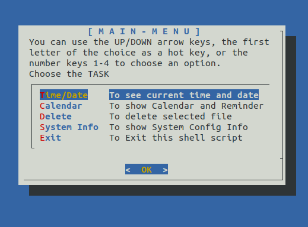
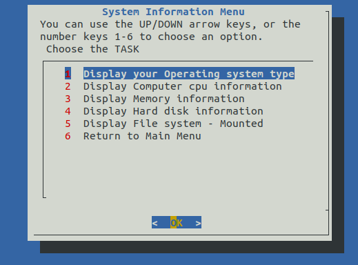

# Bash Dialog Menus

It uses the `dialog` package to create interactive menus and dialogue boxes.





## Features

1. Display Current Time and Date
2. View Calendar and perform CRUD operation for Reminders on specific dates.
3. Delete Files
4. Retrieve System Information using `/proc/cpuinfo`

Please note that the script uses temporary files for storing menu options and output. These files are automatically created and deleted during script execution.

## Requirements

To run these scripts, you need a Linux environment with Bash and the `dialog` package installed. These scripts were developed and tested on Ubuntu 22.10.

## Usage

Give appropriate permission to `main.sh` using `chmod` and execute it:

  ```bash
  bash main.sh
  ```

This will start the script, and you can navigate through the menus using the arrow keys or by typing the corresponding number key.

The `system_info.sh` script is automatically made in an executable by main.sh when selecting the "System Info" option.

To run the `system_info.sh` script directly, execute the following command in the terminal:

  ```bash
  ./system_info.sh
  ```
